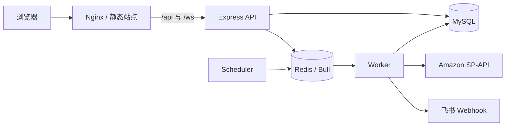

# Amazon ASIN Monitor

面向 Amazon 商品运营的全栈 ASIN 监控平台。系统围绕变体关系检查、定时监控、竞品监控、异常通知和历史分析构建，并提供用户权限、任务队列、审计日志与运维观测能力。

> 2026-07-15 之前的 README 已原样存档为 [`README.archive-2026-07-15.md`](./README.archive-2026-07-15.md)。存档仅用于追溯，当前安装与部署请以本文和代码中的示例配置为准。

## 功能概览

- **ASIN 与变体组管理**：创建、编辑、移动、批量删除以及 Excel 导入/导出。
- **多站点监控**：支持 US、UK、DE、FR、IT、ES，并按 US/EU 区域配置 SP-API。
- **监控任务**：手动检查、定时检查、批量检查、父 ASIN 查询和执行进度跟踪。
- **竞品监控**：独立维护竞品 ASIN、变体组和监控历史，可使用独立数据库。
- **历史与分析**：监控记录、异常时长、趋势与多维聚合分析，并支持报表导出。
- **告警通知**：按 US/EU 区域配置飞书 Webhook，在异常场景下发送通知。
- **任务中心**：基于 Redis 与 Bull 执行导入、导出、备份、批量删除和变体检查等后台任务。
- **账号与安全**：JWT 认证、角色权限、会话管理、密码策略和操作审计。
- **运维能力**：健康检查、Prometheus 指标、WebSocket 实时进度、日志脱敏和备份恢复。

## 技术栈

| 层级     | 主要技术                                               |
| -------- | ------------------------------------------------------ |
| 前端     | React 18、TypeScript、Umi Max 4、Ant Design 5、ECharts |
| 后端     | Node.js、Express、WebSocket (`ws`)、`node-cron`        |
| 数据     | MySQL 8.0+、Redis、Bull                                |
| 外部服务 | Amazon Selling Partner API、飞书 Webhook               |
| 运维     | Nginx、Prometheus 指标、API/Worker 分角色部署          |

## 运行结构



开发环境可以用一个 `all` 进程同时承载 API、调度器和队列消费者；生产环境建议拆分 API 与 Worker，并保证同一套环境只有一个调度器实例。

## 快速开始

### 1. 准备依赖

建议准备以下环境：

- Node.js 20+ 与 npm（优先使用 LTS 版本）
- MySQL 8.0+（分析查询使用了 CTE 和窗口函数）
- Redis 5.0+ 或兼容服务
- 可用的 Amazon SP-API 凭据（实际执行监控时需要）

### 2. 安装依赖

在项目根目录执行：

```bash
npm install
npm --prefix server install
```

自动化环境可将 `npm install` 替换为 `npm ci`，以严格按锁文件安装。

### 3. 创建环境配置

macOS / Linux：

```bash
cp .env.example .env
cp server/.env.example server/.env
```

PowerShell：

```powershell
Copy-Item .env.example .env
Copy-Item server/.env.example server/.env
```

前端默认使用同源 `/api`，通常无需修改根目录 `.env`。后端启动前至少需要正确配置：

| 变量                      | 用途                                             |
| ------------------------- | ------------------------------------------------ |
| `DB_HOST` / `DB_PORT`     | 主数据库地址                                     |
| `DB_USER` / `DB_PASSWORD` | 主数据库账号                                     |
| `DB_NAME`                 | 主数据库名，默认示例为 `amazon_asin_monitor`     |
| `JWT_SECRET`              | 登录令牌签名密钥；生产环境必须替换示例值         |
| `REDIS_URL`               | Bull 队列、任务状态和分布式限流使用的 Redis 地址 |
| `CORS_ORIGIN`             | 非同源部署时允许访问 API 的前端地址              |

完整配置和默认值见 [`server/.env.example`](./server/.env.example)。SP-API 凭据既可以写入环境变量，也可以在管理员登录后通过“系统设置”维护；数据库中的配置优先。

### 4. 初始化数据库

全新安装执行以下脚本：

```bash
mysql -u root -p < server/database/init.sql
mysql -u root -p < server/database/competitor-init.sql
```

`init.sql` 已包含自动备份使用的 `backup_config` 表及默认关闭的配置，新装无需额外执行 `019`。第二条命令创建固定的独立竞品数据库；只有明确关闭竞品监控时才可跳过。旧库升级到自动备份功能时，仍应按实际 schema 判断是否执行 `server/database/migrations/019_add_backup_config_table.sql`。

已有数据库升级前必须先备份，再根据 [`server/database/MIGRATION.md`](./server/database/MIGRATION.md) 选择并执行迁移；不要用全新初始化流程替代升级流程。

### 5. 创建管理员

管理员用户名固定为 `admin`。初始化密码必须满足密码策略，且首次登录后会被要求修改。

macOS / Linux：

```bash
cd server
INIT_ADMIN_PASSWORD='ChangeMe_2026_Strong!' node init-admin-user.js
cd ..
```

PowerShell：

```powershell
Set-Location server
$env:INIT_ADMIN_PASSWORD = 'ChangeMe_2026_Strong!'
node init-admin-user.js
Remove-Item Env:INIT_ADMIN_PASSWORD
Set-Location ..
```

不要将初始化密码写入 `.env`、脚本、日志或版本库。

### 6. 启动开发环境

打开两个终端，在项目根目录分别运行：

```bash
# 终端 1：后端，默认 http://localhost:3001
npm --prefix server run dev
```

```bash
# 终端 2：前端，默认 http://localhost:8000
npm run dev
```

Umi 开发服务器会把 `/api` 代理到 `http://localhost:3001`，WebSocket 在开发环境也会直连该端口。

### 7. 基础检查

```bash
# 数据库连接
npm --prefix server run test-db

# Redis 与 Bull 队列
npm run check-redis

# 后端健康状态
curl http://localhost:3001/health
```

最后访问 `http://localhost:8000`，使用 `admin` 和初始化密码登录。

## 核心配置

### SP-API

系统把站点映射到两个凭据区域：

| 区域 | 站点               | 环境变量前缀  |
| ---- | ------------------ | ------------- |
| US   | US                 | `SP_API_US_*` |
| EU   | UK、DE、FR、IT、ES | `SP_API_EU_*` |

区域配置缺失时会回退到全局 `SP_API_*`。如启用 `SP_API_USE_AWS_SIGNATURE=true`，还必须配置 Access Key、Secret Access Key 和 Role ARN。HTML 抓取及旧客户端兜底默认关闭，启用前应评估稳定性与合规风险。

SP-API usage plan 按 operation 和账号等因素确定，本地 `SP_API_RATE_LIMIT_*` 只是区域保护上限。负载分析只估算定时任务，实时状态依赖 API/Worker 共用 Redis；不要把本地上限设置得高于账号的实际配额。相关工具见：

```bash
npm --prefix server run analyze-quota
npm --prefix server run monitor-quota
```

### 进程角色与队列

| `PROCESS_ROLE` | HTTP API | Scheduler | 队列消费者 | 适用场景 |
| --- | --- | --- | --- | --- |
| `all` | 是 | 由 `SCHEDULER_ENABLED` 控制 | 是 | 本地开发、单进程部署 |
| `api` | 是 | 由 `SCHEDULER_ENABLED` 控制 | 否 | 生产 API 实例 |
| `worker` | 否 | 否 | 是 | 生产队列消费者 |

`WORKER_ENABLED_QUEUES` 可限制 Worker 注册的队列，留空或设为 `all` 时注册全部队列。可选队列及并发参数以 [`server/.env.example`](./server/.env.example) 为准。

生产环境需要注意：

- 所有 API 与 Worker 必须连接同一套 MySQL 和 Redis。
- 同一环境只保留一个 `SCHEDULER_ENABLED=true` 的 API 实例，避免重复生成定时任务。
- 多套环境共用 Redis 时，为 `BULL_PREFIX` 和 `RATE_LIMITER_KEY_PREFIX` 设置不同前缀。
- API 与 Worker 分布在不同主机时，共享或持久化 `server/tasks` 与 `server/backups`，否则任务下载和备份恢复可能找不到文件。
- 优先增加 Worker 实例数，再小幅提高单实例并发，并持续观察 SP-API 429、数据库连接池与 Redis 负载。

### API 地址规则

业务接口统一使用 `/api/v1` 前缀。前端请求层和导出层都会规范化 `API_BASE_URL`，但部署配置仍应遵循以下规则：

- 推荐同源配置：`API_BASE_URL=/api`。
- 跨域配置可填写站点源地址或带 `/api` 的地址，例如 `https://api.example.com` 或 `https://api.example.com/api`。
- 跨 origin 部署还必须正确设置后端 `CORS_ORIGIN`。当前会话 Cookie 使用 `SameSite=Lax`，适合 HTTPS 下的同站点子域；跨站点部署需要另行设计 `SameSite=None; Secure` 与 CSRF 防护，不能只修改 URL。
- 基础地址末尾不要保留 `/`。
- 请求路径已经包含 `/api/v1`，不要再次手工拼接 `/api`。
- Nginx 应保留原始请求路径，`proxy_pass` 不要再附加 `/api` 或 `/api/v1`。

正确结果应始终类似：

```text
/api/v1/health
/api/v1/export/asin
```

不应出现：

```text
/api/api/v1/health
/api/v1/v1/export/asin
```

仓库中的 [`nginx.conf.example`](./nginx.conf.example) 已按此规则配置。

### 日志

后端统一通过 `server/src/utils/logger.js` 记录日志：

- `DEBUG`：SQL、缓存命中和流程追踪等诊断信息。
- `INFO`：启动、调度、任务完成等正常业务事件。
- `WARN`：限流、重试、降级和可恢复问题。
- `ERROR`：异常、外部接口失败等需要处理的问题。

生产环境建议 `LOG_LEVEL=INFO`，并保持 `LOG_SANITIZE=true`。不要记录密码、Token、Authorization 头、Webhook 或完整外部响应载荷。

## 生产部署

### 构建前端

```bash
npm run build
```

构建产物位于 `dist/`。Nginx 需要同时完成：

- 托管 `dist/` 并为 SPA 配置 `try_files ... /index.html`。
- 将 `/api` 原样转发到后端端口。
- 将 `/ws` 以 WebSocket 升级连接转发到后端。
- 将上传大小和长请求超时设置为与后端任务相匹配的值。
- 单层 Nginx 反代时设置 `TRUST_PROXY=1`，确保限流与审计使用正确的客户端地址。

可直接以 [`nginx.conf.example`](./nginx.conf.example) 为起点，并按实际域名、证书、静态目录和端口调整。

### 启动后端

单进程模式：

```bash
cd server
npm start
```

Linux / macOS 上的拆分模式：

```bash
cd server
npm run start:api
```

```bash
cd server
npm run start:worker
```

Windows 部署请在进程管理器中设置 `PROCESS_ROLE` 后直接运行对应入口；`start:api` 和 `start:worker` 脚本使用 POSIX 环境变量语法。

生产环境应使用 PM2、systemd、容器编排或面板进程守护，并通过 HTTPS 对外提供服务。建议先启动 Worker，再启动 API。

## 运维端点

| 地址                 | 说明                              |
| -------------------- | --------------------------------- |
| `GET /health`        | 综合健康检查；降级时返回 HTTP 503 |
| `GET /api/v1/health` | 带 API 前缀的同一健康检查         |
| `GET /metrics`       | Prometheus 文本指标               |
| `/ws`                | 任务和监控进度的 WebSocket 通道   |

`/metrics` 默认由应用直接暴露。公网部署时应通过防火墙、Nginx allowlist 或独立内网入口限制访问。

数据分析聚合表可手动回填：

```bash
npm --prefix server run rebuild:agg
```

执行前先确认数据库负载和 `ANALYTICS_AGG_*` 回填窗口配置。

## 常用命令

### 项目根目录

| 命令                                 | 说明                         |
| ------------------------------------ | ---------------------------- |
| `npm run dev`                        | 启动前端开发服务器           |
| `npm run build`                      | 构建前端到 `dist/`           |
| `npm run format`                     | 使用 Prettier 格式化项目文件 |
| `npm run check-redis`                | 检查 Redis 与 Bull 队列连接  |
| `npm run bench:analytics -- --help`  | 查看数据分析基准脚本参数     |
| `node scripts/test-env.js`           | 检查后端环境变量             |
| `node scripts/test-build.js --build` | 执行并检查完整前端构建       |

### `server/` 目录

| 命令                           | 说明                                   |
| ------------------------------ | -------------------------------------- |
| `npm run dev`                  | 使用 nodemon 启动后端                  |
| `npm start`                    | 启动后端入口，角色取自 `.env`          |
| `npm run start:api`            | 仅启动 API 角色（POSIX）               |
| `npm run start:worker`         | 仅启动 Worker 角色（POSIX）            |
| `npm run test-db`              | 测试主数据库连接                       |
| `npm run test:all`             | 运行后端集成检查；需要已配置的依赖服务 |
| `npm run test:task-regression` | 运行后台任务回归检查                   |

## 项目结构

```text
Amazon-ASIN-monitor/
├─ src/                         # React/Umi 前端
│  ├─ pages/                    # 页面
│  ├─ components/               # 公共组件
│  ├─ services/                 # API 与 WebSocket 客户端
│  └─ utils/                    # 导出、任务、鉴权等工具
├─ server/
│  ├─ src/
│  │  ├─ controllers/           # HTTP 控制器
│  │  ├─ routes/                # /api/v1 路由
│  │  ├─ models/                # 数据访问
│  │  ├─ services/              # 监控、调度、队列与外部服务
│  │  ├─ workers/               # CPU/IO Worker 线程任务
│  │  └─ utils/                 # 日志、时间与安全工具
│  ├─ database/                 # 初始化 SQL 与迁移
│  ├─ scripts/                  # 运维、配额和回归脚本
│  └─ .env.example              # 后端完整环境模板
├─ scripts/                     # 前端检查与分析基准脚本
├─ .env.example                 # 前端 API 地址模板
├─ .umirc.ts                    # Umi 路由与开发代理
└─ nginx.conf.example           # 生产反向代理示例
```

## 常见问题

### 前端请求出现 `/api/api/...` 或 `/api/v1/v1/...`

前端请求、同步导出、异步导出和任务下载已共用同一套 URL 规范化逻辑，并兼容站点源地址、`/api` 与 `/api/v1` 三类 `API_BASE_URL`。部署时仍需检查根目录 `.env` 和 Nginx `proxy_pass`：Nginx 必须原样转发 `/api/v1/...`，不能在上游地址再次追加 `/api` 或 `/api/v1`。修改后运行 `npm run test:contracts`，同时验证普通请求和导出请求。

### 后台任务一直等待

确认 Redis 可连接、至少有一个 `worker` 或 `all` 进程正在运行，并检查目标队列是否包含在 `WORKER_ENABLED_QUEUES` 中。

### 定时任务重复执行

检查所有 API 实例的 `SCHEDULER_ENABLED`。横向扩容时只能有一个实例设为 `true`。

### 监控频繁遇到 429

降低监控并发、增加 `MONITOR_BATCH_COUNT` 或延长调度间隔，并运行配额分析工具确认计划调用量。批次数增加会同步延长完整覆盖周期；实际 Amazon 限额仍需结合响应头和 429 判断。

### 健康检查返回 503

查看响应中的数据库、内存、限流器和缓存状态，再结合服务端日志定位。健康阈值可通过 `HEALTH_*` 变量调整。

### 生产环境刷新页面返回 404

确认 Nginx 的站点根目录指向 `dist/`，并为前端路由配置 SPA 回退：`try_files $uri $uri/ /index.html;`。

## 相关文档

- [`server/database/README.md`](./server/database/README.md)：数据库文件与初始化说明
- [`server/database/MIGRATION.md`](./server/database/MIGRATION.md)：已有数据库升级指南
- [`server/scripts/QUOTA-GUIDE.md`](./server/scripts/QUOTA-GUIDE.md)：SP-API 配额分析说明
- [`nginx.conf.example`](./nginx.conf.example)：Nginx/1Panel 配置起点
- [`AGENTS.md`](./AGENTS.md)：仓库开发约定与 PR 描述格式
- [`README.archive-2026-07-15.md`](./README.archive-2026-07-15.md)：旧版 README 存档

## 安全提示

- 不要提交 `.env`、数据库备份、访问令牌、Webhook 或任何真实凭据。
- 生产环境必须替换 `JWT_SECRET`、使用强密码并启用 HTTPS。
- 当前部分业务路由尚未统一强制后端鉴权；不要把后端 `3001` 端口直接暴露到公网，只能通过受控网络和反向代理开放必要路径。
- 仅向可信网络开放 MySQL、Redis、`/health`、`/metrics` 和内部 Worker。
- 定期验证备份可恢复性；执行迁移、恢复或大规模回填前先创建独立备份。
- 数据库恢复会覆盖当前数据且不可逆，执行前同时核对目标数据库和备份文件。
- SP-API 与飞书配置属于敏感数据，排障时只记录最小上下文，不要输出完整请求或响应。
